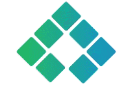

<!--
- ⚡⚡⚡ Не передирай мое оформление профиля! 
⚡ Copycat list (мои "близняшки"):
https://github.com/andreyzavrichko
https://github.com/Andrey2694
https://github.com/sonmeniya
https://github.com/Vasili888-QA
https://github.com/SaleevaMariia
...
-->

  

:heavy_check_mark: *I’m having a 5+ years of experience in information technology industry. Currently I’m working **QA engineer**. I like to be involved in all stages of software development and provide customers with a quality product!*

## What am I currently up to?

  
  
  
  
  
  
  
  
  

<h2> My projects </h2>

  
  
   
   
   
   

  

  <h2>Languages and tools</h2>

<!-- -->

   
  <code></code>
  <code></code>
  <code></code>
  <code></code>
  <code></code>
  
  <code></code>
  <code></code>
  <code></code>
  <code></code>
  <code></code> 
  
  <code></code>
  <code></code>
  <code></code>
  <code></code>
  <code></code>
<!-- <code></code> -->
 

### :open_umbrella: When I'm not testing you can find me:

:mushroom:  <code><strong>*Cooking*</strong></code>

:open_book:  <code><strong>*Reading*</strong></code>

:headphones: <code><strong>*Listening the music*</strong></code> 

:herb: <code><strong>*Taking care of plants*</strong></code> 

:purple_heart:  <code><strong>*Watching the sunset*</strong></code>

<h2> Contacts </h2>

 

  

<!--
|  |  |
| ------------- | ------------- |
-->
